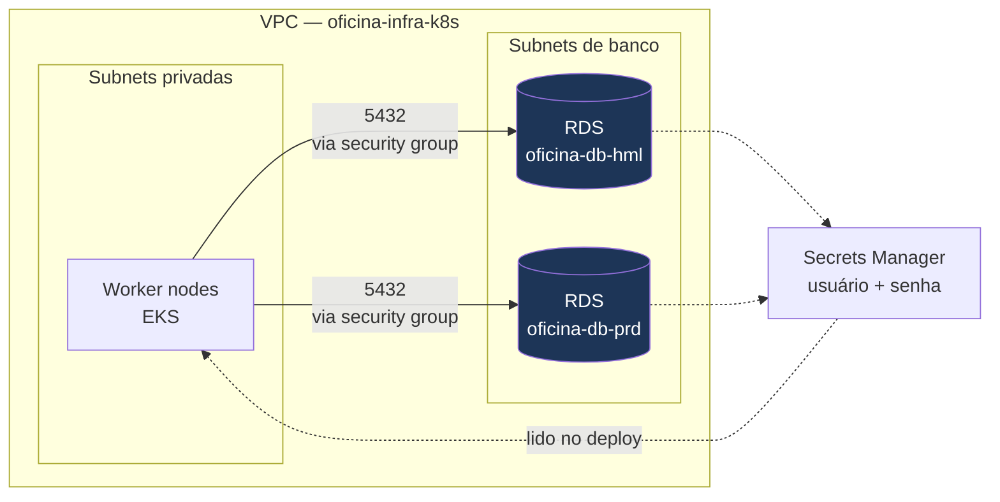

# oficina-infra-database — Banco de Dados Gerenciado (Terraform)

Camada de **dados** do Tech Challenge SOAT 13 — Fase 3. Provisiona, via
Terraform na AWS, uma instância **RDS PostgreSQL** por ambiente
(homologação e produção), acessível **apenas** a partir dos worker nodes do
cluster EKS, com a senha gerada e custodiada pelo **AWS Secrets Manager**.

Não contém DDL nem migrações: o schema é versionado pelo **Flyway**, dentro do
repositório da aplicação, e aplicado no start do pod.

## Lugar na arquitetura



**Pré-requisito:** a plataforma (`oficina-infra-k8s`) precisa estar aplicada.
Este repositório lê `vpc_id`, `database_subnet_group_name` e
`node_security_group_id` do state dela via `terraform_remote_state`.

## O que é criado (por ambiente)

| Recurso | Detalhe |
|---|---|
| `aws_db_instance.main` | PostgreSQL 15, `db.t3.micro`, 20 GiB gp3 **criptografado**, com *storage autoscaling* até 50 GiB (hml) / 100 GiB (prd) |
| `aws_security_group.rds` | Sem ingress por CIDR e sem acesso público: a porta 5432 só aceita tráfego **referenciando o security group dos nodes do EKS** |
| Segredo no Secrets Manager | Criado e rotacionável pelo próprio RDS (`manage_master_user_password`); a senha **nunca** entra no state nem no repositório |
| Logs no CloudWatch | Exports `postgresql` e `upgrade` + **Performance Insights** (7 dias) — base para a análise de gargalos exigida no requisito de observabilidade |

### Diferenças entre ambientes

Tudo o que varia está em `var.environments`, em `variables.tf`:

| | `hml` | `prd` |
|---|---|---|
| Retenção de backup | 0 dia | **7 dias** (PITR) |
| Teto de storage | 50 GiB | 100 GiB |
| Multi-AZ | não | não *(decisão de custo)* |
| Snapshot final no destroy | não | não *(ambiente de demo)* |

## Tecnologias

Terraform ≥ 1.10 (**workspaces**) · AWS provider ~> 6.0 · Amazon RDS for
PostgreSQL 15 · AWS Secrets Manager · CloudWatch Logs + Performance Insights ·
backend S3 com *lockfile* · GitHub Actions.

## Como aplicar

**Opção A — pela pipeline (recomendado):** merge em `homologacao` aplica o
ambiente `hml`; merge em `master` aplica o `prd`. Para rodar sob demanda:
**Actions** → *Terraform (banco de dados)* → *Run workflow* → escolha o
ambiente e a ação.

**Opção B — local:**

```bash
cp backend.hcl.example backend.hcl              # preencha a bucket do state
cp terraform.tfvars.example terraform.tfvars    # mesma bucket, para o remote_state

terraform init -backend-config=backend.hcl

terraform workspace select -or-create hml       # ou prd
terraform plan
terraform apply                                 # ~8-12 min na criação
```

⚠️ **Sempre selecione o workspace.** O código rejeita o workspace `default` com
uma mensagem explícita — sem essa trava, um `apply` distraído criaria uma
terceira instância cobrada e fora de qualquer ambiente.

Saída:

```bash
terraform output
# db_instance_identifier = "oficina-db-hml"
# db_endpoint            = "oficina-db-hml.xxxx.us-east-1.rds.amazonaws.com:5432"
# jdbc_url               = "jdbc:postgresql://oficina-db-hml.xxxx...:5432/oficina_db"
# master_user_secret_arn = "arn:aws:secretsmanager:..."
```

## Contrato com o repositório da aplicação

A pipeline de `oficina-app` **não lê o state deste repositório**. Ela descobre o
banco pelo identificador previsível:

```bash
aws rds describe-db-instances --db-instance-identifier oficina-db-<ambiente>
```

e lê usuário/senha do ARN em `MasterUserSecret.SecretArn`. Portanto:

> **`oficina-db-hml` e `oficina-db-prd` são nomes de contrato.** Renomeá-los
> quebra o deploy da aplicação.

## CI/CD

Workflow: [`.github/workflows/terraform.yml`](.github/workflows/terraform.yml)

| Gatilho | O que roda |
|---|---|
| Pull request | `fmt` → `validate` → `plan` dos **dois** workspaces, cada um comentado no PR |
| Push em `desenvolvimento` | `fmt` → `validate` → `plan` dos dois workspaces |
| **Push em `homologacao`** | **`apply` automático no workspace `hml`** |
| **Push em `master`** | **`apply` automático no workspace `prd`** |
| *Run workflow* manual | `plan`, `apply` ou `destroy` no ambiente escolhido |

Cada ambiente tem seu próprio grupo de `concurrency`, então dois pushes seguidos
na mesma branch nunca disputam o *lock* do state. Os jobs de `apply`/`destroy`
usam GitHub **Environments** (`homologacao` / `producao`), o que permite exigir
aprovação manual antes de produção sem tocar no YAML.

### Configuração exigida no repositório

| Tipo | Nome | Valor |
|---|---|---|
| Secret | `AWS_ACCESS_KEY_ID` | Credencial AWS da pipeline |
| Secret | `AWS_SECRET_ACCESS_KEY` | — |
| Variable | `TF_STATE_BUCKET` | **A mesma bucket** usada por `oficina-infra-k8s` |
| Variable | `AWS_REGION` | Opcional, default `us-east-1` |

A credencial precisa de `s3:GetObject` na key `oficina/infra-k8s.tfstate` — é
assim que este repositório lê os outputs da plataforma.

### Regras de proteção de branch

- `master` e `homologacao` protegidas: sem push direto, merge apenas via Pull Request com aprovação.
- Fluxo `feature/*` → `desenvolvimento` → `homologacao` → `master`, imposto pelo job `guard` ([`pr-source-guard.yml`](.github/workflows/pr-source-guard.yml)).

## Custo estimado (us-east-1)

| Recurso | ~US$/hora |
|---|---|
| RDS `db.t3.micro` × 2 (hml + prd) | 0,034 |
| Storage gp3 20 GiB × 2 | ~0,006 |
| **Total desta camada** | **≈ 0,04/h (~US$ 1,00/dia)** |

## Destruir

Destrua **antes** da plataforma — este repositório depende dos outputs dela.

```bash
# Actions -> Terraform (banco de dados) -> destroy, uma vez para hml e outra para prd
# ou, local:
terraform workspace select hml && terraform destroy
terraform workspace select prd && terraform destroy
```

## Limitações conhecidas (escopo de desafio técnico)

- **Single-AZ e sem réplica de leitura.** Produção real pediria `multi_az = true`; aqui dobraria o custo do banco sem agregar à demonstração.
- **`deletion_protection = false` em produção.** Deliberado: o ambiente é destruído ao fim de cada demonstração para não acumular custo.
- **Sem snapshot final.** Mesma razão.
- **Banco alcançável só de dentro da VPC.** Para inspecionar localmente, use `kubectl port-forward` a partir de um pod utilitário.

## Documentação

- [ADR 0001 — Consumo do state da plataforma e isolamento por workspace](docs/adr/0001-consumo-do-state-da-plataforma.md)
- Modelagem de dados, diagrama ER e justificativa do banco: repositório `oficina-app`
